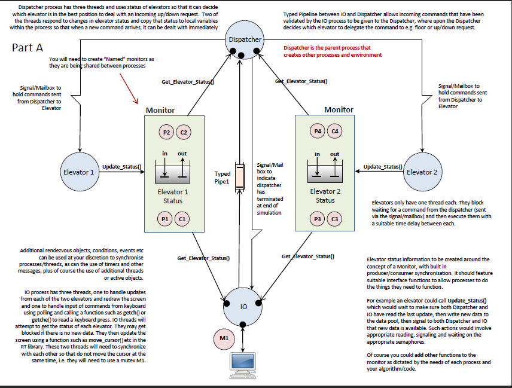
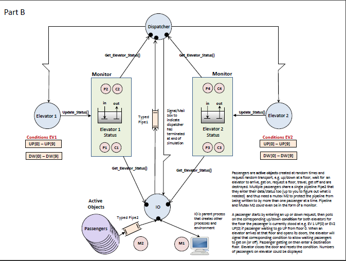

# CPP-Real-Time-System
Implementation of a virtual elevator real-time system

This was a project for the UBC course CPEN 333 - Introduction to Software Engineering.

Below is the full description of the project, written by Paul Davies

## Introduction:
Sources within UBC have recently put out to contract, the design and installation of a ten-storey duplex Elevator system for a new high technology science block that it is intending to build in June 2020.
However, following recent complaints about the inefficiency of other elevator systems within the University it has been unanimously decided that each of the companies putting forward a proposal for their new elevator system, should first supply a simulation model which accurately reflects the algorithms used by each company to dispatch elevators to deal with passenger requests. The various simulation models are to be judged by an independent expert, to arrive at the most effective design.
For the purposes of this assignment, you are an employee of one of the companies involved in demonstrating your design, the dubiously named ‘Freefall’ Elevator Company of Toronto. You have been asked by your manager to design a simulation model of such a duplex elevator incorporating the dispatcher algorithm used in your real elevator, so that it can be presented for evaluation. As is typical in such circumstances, only a brief specification of the model is available, so you will have to use some imagination in implementing it. The following description of the model is available.

## Model Specification - Part A:
(1) A double elevator system, responding to requests made either from within the elevator, or from requests made outside the elevator for transportation of passengers both up/down and to the specified/destination floors. Fault simulation must be implemented, with particular attention then being placed on the effective use of the other elevators.
(2) The simulation model should at all times, inform the person running the simulation of its actions, so that an effective comparison can be made. The simulation output is to take place via the computer display window and should show the following information relating to each elevator: Direction (up/down), General Status (in/out of service etc), Door Status (open/closed) and Current Floor Number.
(3) The time taken to travel between floors, open and close doors etc. should be reasonably accurately modelled, but scaled down to run faster (but not too fast) as this is a simulation.
(4) The elevator and its floor numbers should be shown graphically on the display screen, using two animated vertical columns, showing the position and status of both elevators as they move between floors.
(5) All simulation inputs are to be entered via the computer keyboard, and the following key codes have been negotiated by all parties concerned

## Requesting Transport once inside the elevator:
Requesting elevator movement from INSIDE the elevator involves entering a two character keyboard sequence. It should NOT be necessary to press the return key at any point in the simulation. Investigate functions like getch() in Visual C++ to help with this.
The first character can be a ‘1’, or ‘2’, to designate a command directed to elevator 1 or 2 respectively, followed by a second character in the range ‘0-9’ to indicate which floor the elevator is being directed to travel to. This simulates a passenger pressing one of the 10 floor destination buttons located inside the elevator. Therefore a passenger stepping into elevator 1 and wishing to travel to floor 3 would be simulated by entering the characters ‘1’ then ‘3’.

## Requesting an elevator while stood outside on a given floor:
A passenger requesting to go UP or DOWN whilst stood OUTSIDE the elevator on a given floor will be simulated by entering two character commands such as ‘u0’,’u8’ and ‘d1’,’d9’, where the letters ‘u’ and ‘d’ refer to a request by the passenger to go UP or DOWN respectively. The subsequent single digit number tells the simulation which floor the request is being made from, not which floor the person wishes to be subsequently transported to. Obviously the passenger cannot direct an UP or DOWN request to a specific elevator, that decision will be left to your dispatcher algorithm which should attempt to send the elevator that is most likely to pick up the passenger in the shortest time, perhaps when passing that floor on its way to somewhere else. Once inside the elevator, the passenger may then direct the elevator to a specific floor by entering a INSIDE command such as ‘12’ etc.
Simulating Elevator Faults and Halting the System:
Faults are to be generated by pressing +1 or -1, +2 or -2. The minus sign ‘-’ informs the simulator that a fault has occurred with that numbered elevator and that it is effectively out of action. The plus sign ‘+’ indicates that the fault has been cleared and operation can resume with that elevator. Each elevator should freeze its actions immediately upon receipt of a simulated fault condition, and should ignore subsequent commands except a command to end the simulation, or clear the fault. There is NO need to transfer outstanding floor requests for an elevator to another one when a fault develops with it. Similarly, when the fault is cleared, the elevator should wait for new commands and NOT try to service any pending requests it had before the fault developed.
The simulation may be terminated at any time by entering the two character sequence ‘ee’. All elevators are then to return to the ground floor, open their doors and stop. No further commands should be accepted during this time and the simulation will then stop.

## Part B – Adding Dynamic Passengers
You should also see an architecture for Part B from your instructor. This one allows for the dynamic creation of passengers as active objects. They are created at random with objectives in mind, e.g. they are designed to stand outside the elevator on say floor 2 and make an UP request, before travelling to say floor 5 and getting off (these are just example, you can play around with floor numbers and up/down requests at run time using some random number generator).
To enable this feature, you should press the character sequence “d+” and to end it the sequence “d-“. You can still enter new requests at the keyboard etc as in Part A

